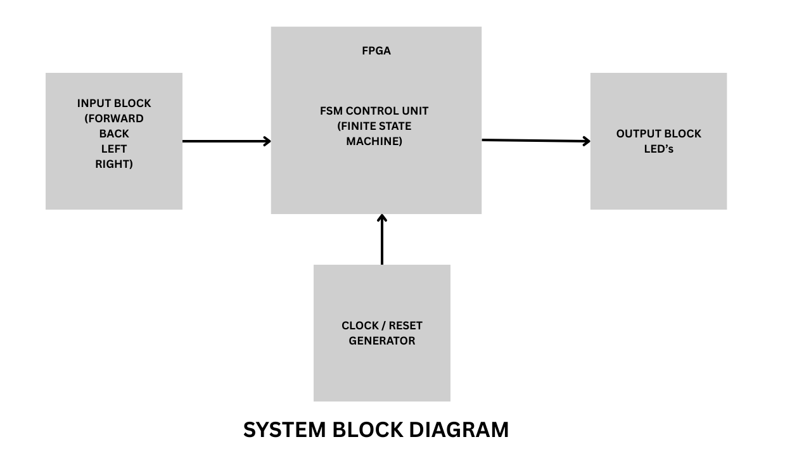

# Project Title
Finite State Machine(FSM) for Robot Movement

# Theme
The chosen theme is **Robotics Control Systems**

## Brief Introduction

A Finite State Model **(FSM)** is a type of model used in robotics to regulate action via a list of pre-defined **states** and **transitions**. A state is a distinct action (an example: Idle, Moving Forward, Turning), and transitions depend on factors such as **sensor input** or **user input**. This method enables robots to make decisions with ease and respond in real-time, such as from "Moving Forward" to "Turning" when an obstacle is encountered — making FSM an ideal solution for efficient and predictable robot regulation.

## Expected Output

### Movement Control
FSM allows directional control: forward, back, left and right and state transitions should be triggered by inputs.

### Obstacle Handling
Sensors detect obstacles and trigger transitions to **STOP** state, to halt movement, or **TURN** state, to avoid collision.

### Error Recovery
FSM includes special reset or recovery states which helps to manage unexpected inputs, system faults or external noise.

# Block Diagram

## Module Names

| Sl No | Module Name          | Description                                           |
|:------|:--------------------:|:-----------------------------------------------------:|
| 01    | top                  | The code which integrates all modules                 |
| 02    | robot_fsm_defines    | Holds all parameter and state definitions             |
| 03    | robot_fsm_control    | Contains the FSM logic (state transition and state register)             |
| 04    | robot_fsm_outputs    | Contains the output logic, mapping FSM state to motor outputs.           |

## I/O Ports Defined

### Input Ports

|Sl No | Signal Name   | Width   | Description                                                                                |
|:----:|:---------------:|:---------:|:--------------------------------------------------------------------------------------:|
|01    | clk           | 1 bit   | System clock.                                                                              |
|02    | rst_n         | 1 bit   | Active-low reset.                                                                          |
|03    | move_fwd      | 1 bit   | Command to move the robot forward.                                                         |
|04    | move_bwd      | 1 bit   | Command to move the robot backward.                                                        |
|05    | turn_left     | 1 bit   | Command to turn the robot left.                                                            |
|06    | turn_right    | 1 bit   | Command to turn the robot right.                                                           |
|07    | obstacle      | 1 bit   | Triggers STOP state or avoidance.                                                          |
|08    | error         | 1 bit   | Triggers ERROR state.                                                                      |
|09    | recover       | 1 bit   | Command to recover/reset from error or STOP state.                                         |

### Output Ports

|Sl No | Signal Name   | Width   | Description                                                                                 |
|:----:|:---------------:|:---------:|:--------------------------------------------------------------------------------------------:|
|01    | state         | [2:0]   | Current state of the FSM (e.g., IDLE, FORWARD, BACKWARD, LEFT, RIGHT, STOP, ERROR, RECOVER)|
|02    | motor_fwd     | 1 bit   | High when robot should move forward.                                                       |
|03    | motor_bwd     | 1 bit   | High when robot should move backward.                                                      |
|04    | motor_left    | 1 bit   | High when robot should turn left.                                                          |
|05    | motor_right   | 1 bit   | High when robot should turn right.                                                         |
|06    | motor_stop    | 1 bit   | High when robot should stop (e.g., on obstacle or error).                                  |

## Why this structure was chosen ?

- Readability: Clear separation of concerns makes the code easier to understand and maintain.

- Testability: Modules can be independently tested and debugged, simplifying verification.

- Scalability: Modular design allows easy extension and reuse in future projects.